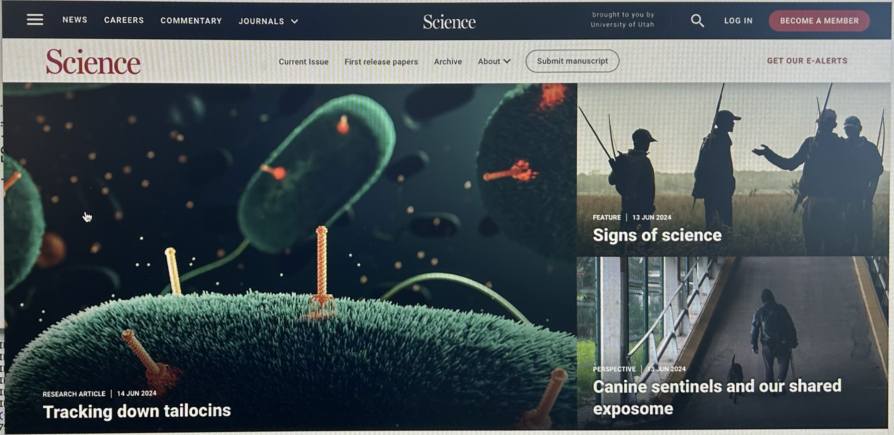

[HOME](http://talia-backman.github.io/) | 
[PUBLICATIONS](http://talia-backman.github.io/publications) | 
[NEWS](http://talia-backman.github.io/news)

 
 

  See one of articles describing my first author research published in <em>Science</em>:

## **[<em>Science</em> Publication](https://www.science.org/doi/10.1126/science.ado0713)**
## **[University of Utah: School of Biological Sciences Article](https://www.biology.utah.edu/uncategorized/tailocins-the-next-generation-of-antibiotics-might-just-come-from-understanding-the-viruses-that-infect-bacteria/)**
## **[University of Utah: @theU Article](https://attheu.utah.edu/facultystaff/the-scary-yet-promising-world-of-phages-the-pathogens-pathogen/)**
## **[earth.com Article](https://www.earth.com/news/bacteriophages-how-bacteria-harness-viruses-to-attack-competitors/)**
## **[TWiM Podcast, second half.](https://www.microbe.tv/twim/twim-316/)**
