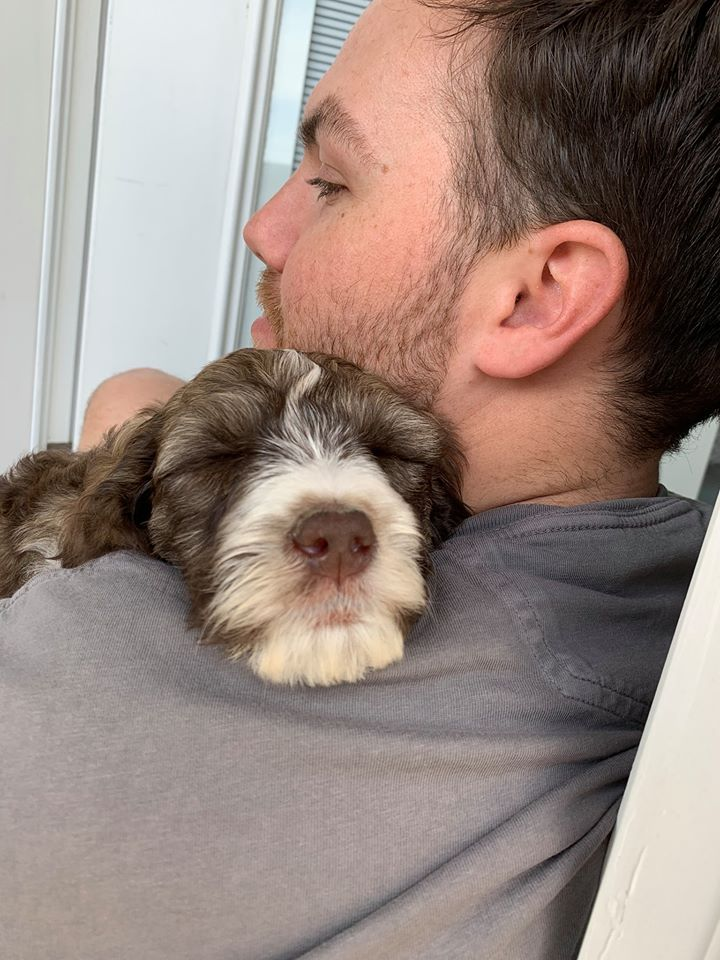

<style type="text/css">
.main-container {
  max-width: 1800px;
  margin-left: auto;
  margin-right: auto;
}
</style>

<style>
div.gray { background-color:#7e8687; border-radius: 5px; padding: 20px;}
</style>
<div class = "gray">


<style>
div.blue { background-color:#9dc9d1; border-radius: 5px; padding: 20px;}
</style>
<div class = "blue">

## [HOME](http://talia-backman.github.io/) | [ABOUT ME](http://talia-backman.github.io/about_me) | [DATA COURSE](http://talia-backman.github.io/data_course) | [FINAL PROJECT](http://talia-backman.github.io/final_project) | [RESEARCH](http://talia-backman.github.io/research)

<div style= "float:right;position: relative;top:10px">
```{r, out.width = "190px",echo=FALSE}

```

# **ABOUT ME**{#top}
Hey, I'm Talia Backman.  I recently graduated from Utah Valley University with a Bachelor's in Biology.  I will be attending the University of Utah in the Fall to get my PhD in Molecular, Cellular, and Evolutionary Biology.  My future goals incude getting a postdoc and becoming a professor.
I was born and raised in Utah and hope to never leave.  It is a beautiful state and I love being outdoors.  My favorite hobbies include running, camping, hiking, skiing, and playing with my pup (his name is Ragnar and to say I love him is an UNDERSTATEMENT).
Thanks for visiting my github!

___


## **[Current CV](http://talia-backman.github.io/about_me/Resume.pdf)**


___


## **[My Github Repositories](https://github.com/talia-backman)**
