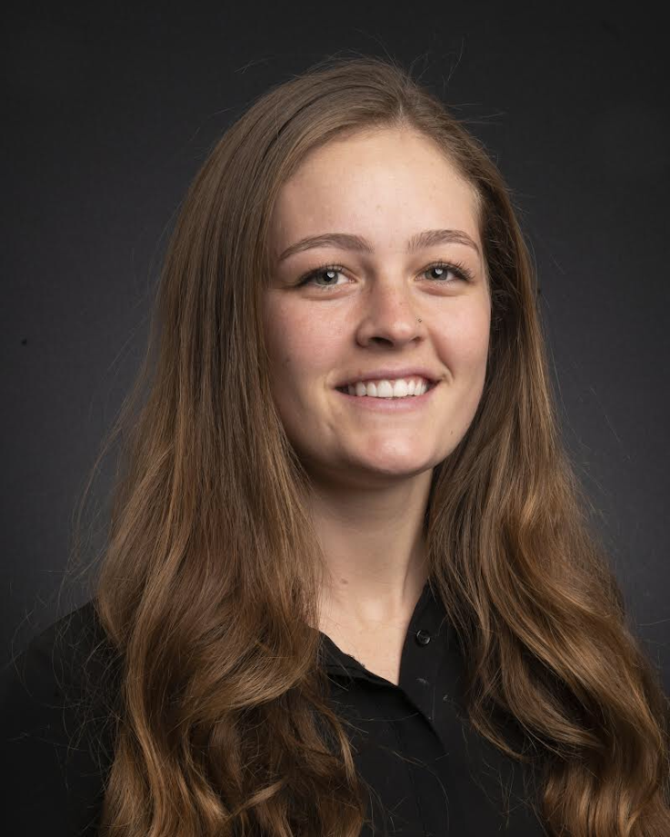

<style type="text/css">
.main-container {
  max-width: 1800px;
  margin-left: auto;
  margin-right: auto;
}
</style>

<style>
div.gray { background-color:#9dc9d1; border-radius: 5px; padding: 20px;}
</style>
<div class = "gray">


<style>
div.blue { background-color:#7e8687; border-radius: 5px; padding: 20px;}
</style>
<div class = "blue">

## [HOME](http://talia-backman.github.io/) | [ABOUT ME](http://talia-backman.github.io/about_me) | [DATA COURSE](http://talia-backman.github.io/data_course) | [FINAL PROJECT](http://talia-backman.github.io/final_project)

# **Talia Backman**

<div style= "float:right;position: relative;top:20px">
```{r, out.width = "600px",echo=FALSE}

```

<br><br><br><br><br><br><br><br><br>
<br><br><br>

</div>

___

<br>

## **Contact Info:**

### Talia Backman<br>
### talia.backman@gmail.com
<br><br><br>

</div>