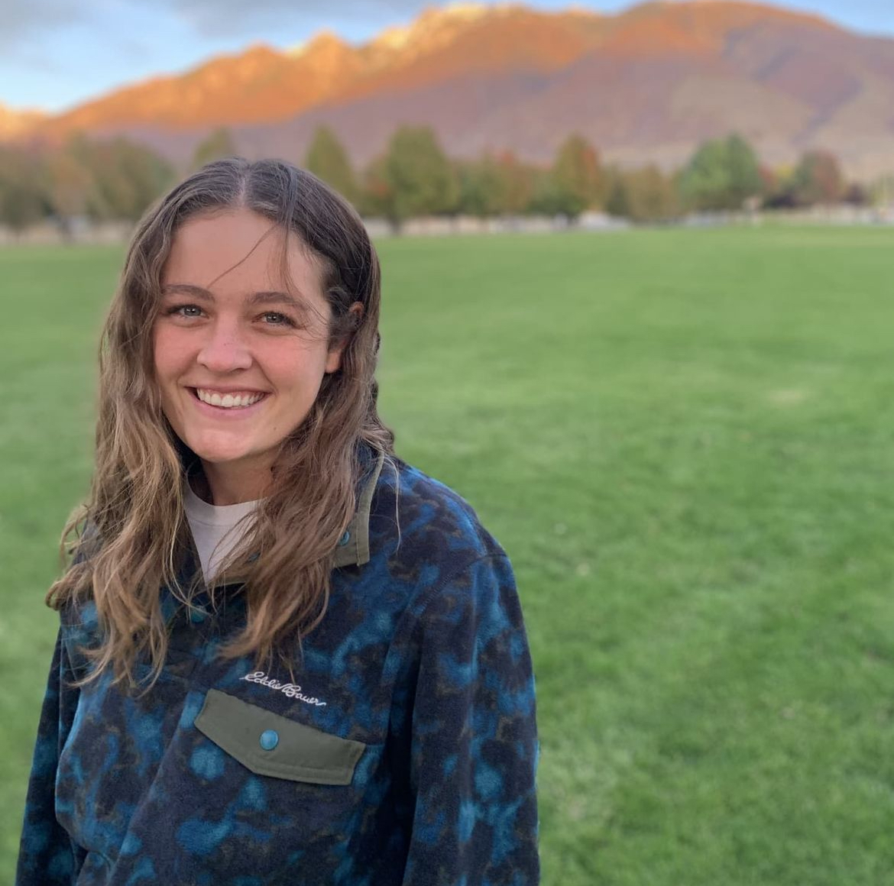

## [HOME](http://talia-backman.github.io/) | [ABOUT ME](http://talia-backman.github.io/about_me) | [PUBLICATIONS](http://talia-backman.github.io/publications)

  

  About Me

I'm Talia! I'm currently a PhD student at the University of Utah in Dr. Talia Karasov's lab. I investigate how bacterial pathogens compete to infect their plant host. 
In Fall 2025, I will be starting a postdoc position in the TIDAL (Dr. Geoffrey Zahn's lab) at Mary & William. Yes, I know it's William & Mary, but I insist on being a insufferable feminist :) 

___
## **[Current CV](http://talia-backman.github.io/about_me/CV_March2025.pdf)**

## **[My Github Repositories](https://github.com/talia-backman)**

## **[The Karasov Lab](https://tkarasovlab.org/)**

## **[The TIDAL Lab](https://gzahn.github.io/)**

___

  Contact info

  Talia Backman

  talia.backman@gmail.com

