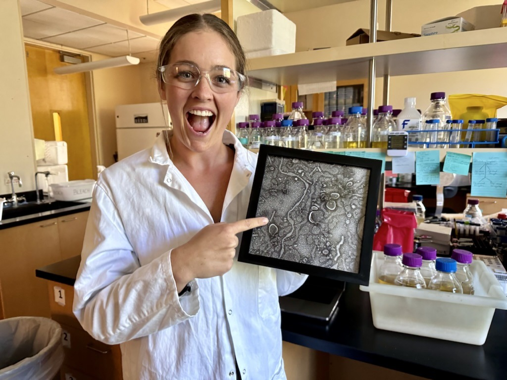
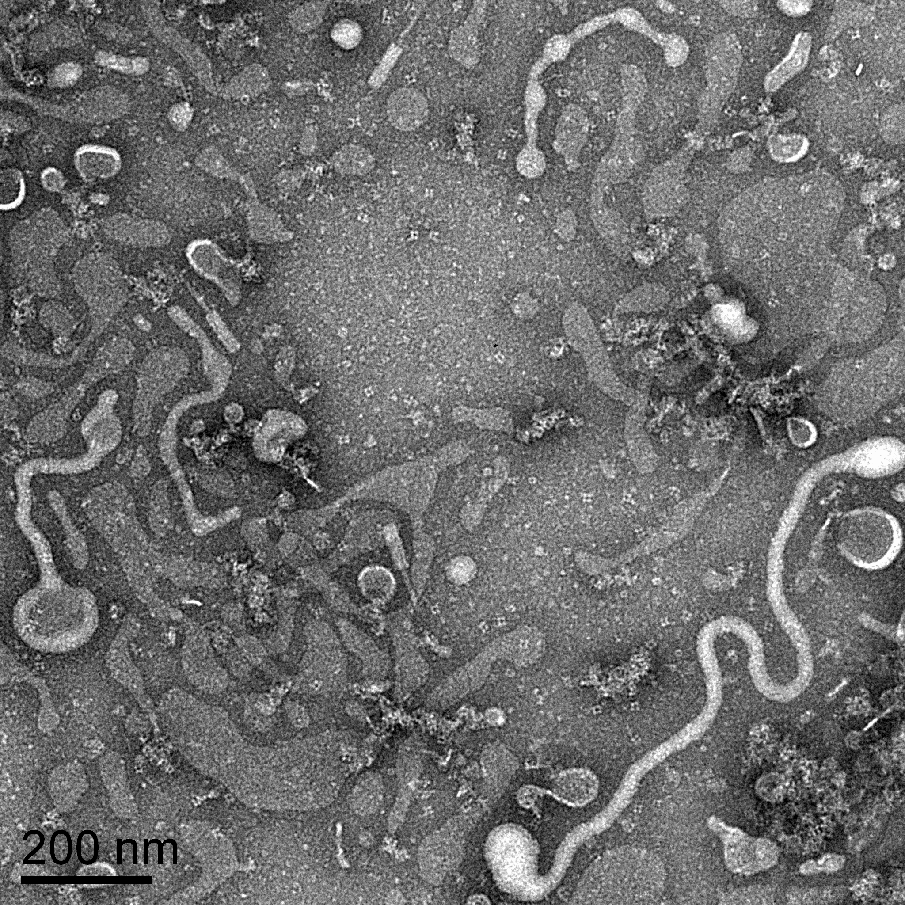
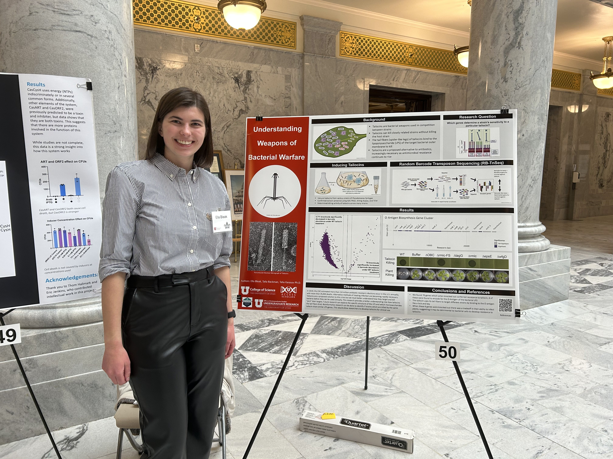

  <a class="home-tile" href="about/">
    
    
ABOUT

  </a>

  <a class="home-tile" href="publications/">
    
    
PUBLICATIONS

  </a>

  <a class="home-tile" href="news/">
    
    
NEWS

  </a>

  <a class="home-tile" href="tbd/">
    
    
MENTEES

  </a>

