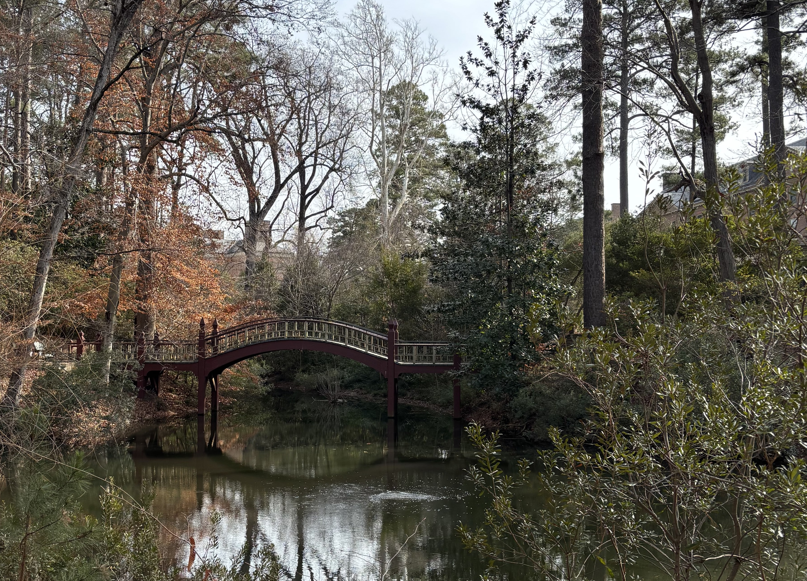
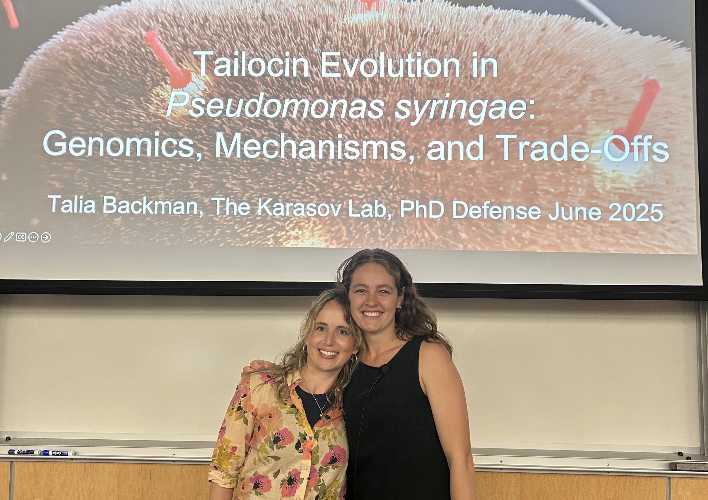
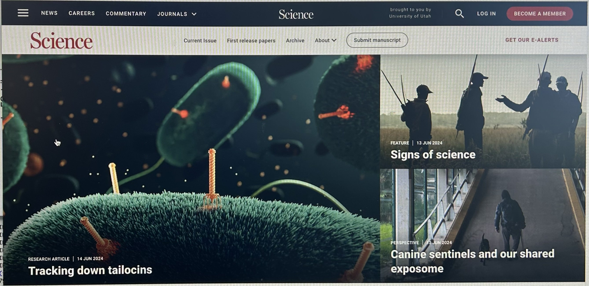

<a href="http://talia-backman.github.io/about">About</a> |
<a href="http://talia-backman.github.io/publications">Publications</a> |
<a href="http://talia-backman.github.io/news">News</a> |
<a href="http://talia-backman.github.io/TBD">TBD</a>

<b>This page highlights recent announcements, publications, talks, and milestones in my research and scientific career.</b>

JANUARY 2026

Started my postdoc position at Mary & William.

JUNE 2025

Successfully defended my PhD! (and cried my eyes out)  
Photo features my PhD supervisor, “big” Talia Karasov.

JUNE 2024

My first author manuscript on tailocin conservation and function in wild plant pathogens is published in <em>Science</em>. 🌱

<b>Links:</b>  
📄 <a href="https://www.science.org/doi/10.1126/science.ado0713" target="_blank" rel="noopener">Journal article (Science)</a>  
🧪 <a href="https://github.com/talia-backman/Ps1524_tailocin" target="_blank" rel="noopener">Code & analysis (GitHub)</a>

<b>Media coverage:</b>  
📰 <a href="https://www.biology.utah.edu/uncategorized/tailocins-the-next-generation-of-antibiotics-might-just-come-from-understanding-the-viruses-that-infect-bacteria/" target="_blank" rel="noopener">University of Utah</a>  
📰 <a href="https://attheu.utah.edu/facultystaff/the-scary-yet-promising-world-of-phages-the-pathogens-pathogen/" target="_blank" rel="noopener">At the U</a>  
📰 <a href="https://www.earth.com/news/bacteriophages-how-bacteria-harness-viruses-to-attack-competitors/" target="_blank" rel="noopener">Earth.com</a>

<b>Podcast discussion:</b>  
🎧 <a href="https://www.microbe.tv/twim/twim-316/" target="_blank" rel="noopener">This Week in Microbiology (TWIM 316)</a> — discussion begins in the second half

 <!-- news-layout -->

